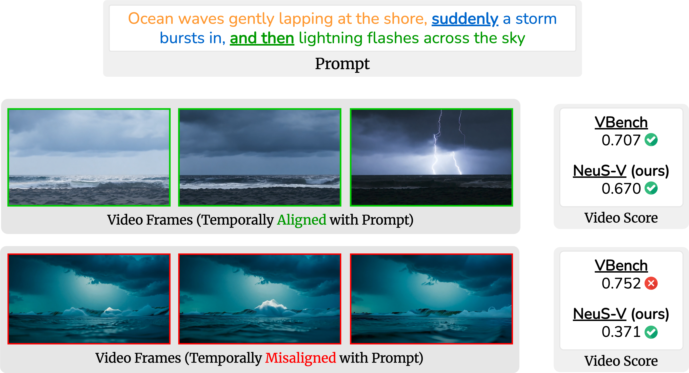

<h2><a href="https://arxiv.org/abs/2411.16718" target="_blank">Neuro-Symbolic Evaluation of Text-to-Video Models using Formal Verification</a></h2>
<b> CVPR 2025 </b>

_**S P Sharan\*, Minkyu Choi\*, Sahil Shah, Harsh Goel, Mohammad Omama, Sandeep Chinchali**_
  
(* Equal Contribution)

The University of Texas at Austin

🚀 Welcome to the repo of **NeuS-V** 🚀

If you appreciate our project, please consider giving us a star ⭐ on GitHub and watch this repo to stay updated with the latest developments.  </h2>

## 🎏 Abstract
<b>TL; DR: NeuS-V is a metric that evaluates whether T2V outputs follow the prompt's temporal structure, using temporal logic and symbolic verification.</b>

> Recent advancements in text-to-video models such as Sora, Gen-3, MovieGen, and CogVideoX are pushing the boundaries of synthetic video generation, with adoption seen in fields like robotics, autonomous driving, and entertainment. As these models become prevalent, various metrics and benchmarks have emerged to evaluate the quality of the generated videos. However, these metrics emphasize visual quality and smoothness, neglecting temporal fidelity and text-to-video alignment, which are crucial for safety-critical applications. To address this gap, we introduce NeuS-V, a novel synthetic video evaluation metric that rigorously assesses text-to-video alignment using neuro-symbolic formal verification techniques. Our approach first converts the prompt into a formally defined Temporal Logic (TL) specification and translates the generated video into an automaton representation. Then, it evaluates the text-to-video alignment by formally checking the video automaton against the TL specification. Furthermore, we present a dataset of temporally extended prompts to evaluate state-of-the-art video generation models against our benchmark. We find that NeuS-V demonstrates a higher correlation by over 5x with human evaluations when compared to existing metrics. Our evaluation further reveals that current video generation models perform poorly on these temporally complex prompts, highlighting the need for future work in improving text-to-video generation capabilities. 
  
## ⚔️ Overview

|  |  |

<!--  -->

<!-- 

| Video 1                                                  | Video 2                                                  |
| -------------------------------------------------------- | -------------------------------------------------------- |
|  |  |
| **VBench Score**: 0.707 **NeuS-V Score**: 0.67         | **VBench Score**: 0.752 **NeuS-V Score**: 0.371        |

 -->
 

**Current generative video evaluation methods struggle with temporal fidelity.** NeuS-V converts prompts into Temporal Logic specifications and formally verifies them against a video automaton. The upper video aligns with the prompt's temporal sequencing, while the lower video, despite being visually appealing, fails to do so. Unlike VBench, NeuS-V effectively differentiates between them.